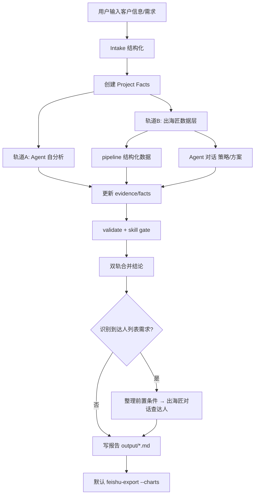

# 客户任务处理总流程（双轨分析 + 达人对话 + 飞书交付）

> **供 Agent 与用户评审**。与 `AGENT.md`、`DELIVERY-STANDARD.md`、`templates/config/delivery-defaults.json` 配套使用。  
> 对外署名：**Vidau**；金额写法禁用 `$`，用「USD / 万美元」。

---

## 一、总览：用户在说什么 → 走哪条路



| 用户意图关键词 | 主 Skill | 是否双轨 | 是否对话查达人 |
|----------------|----------|----------|----------------|
| TTS 全案 / 布局 TikTok | tts-full-case → tts-growth-plan | ✅ | 含 KOL 章节时 ✅ |
| 合作方案 / 代运营报价 | tts-partnership-proposal | ✅ | Package 含达人时 ✅ |
| Amazon 代运营 | amazon-agency-plan | ✅（Amazon 轨 + 出海匠品类轨） | 可选 |
| 只要达人名单 / BD 名单 | chuhaijiang-data | 轻量 A 轨 | ✅ 必做 |
| 轻量数据查询（仅 B1） | 否 | 否 | 否 |

---

## 二、阶段 0 — Intake（客户信息结构化）

### 2.1 通用字段（`templates/intake-tts.json`）

品牌、链接（Amazon/TTS/独立站）、类目、主力 SKU、ASP、目标 GMV、区域、竞品关键词、预算、交付周期等。

### 2.2 达人对话专用字段（`templates/intake-creator-agent.json`）

在识别到**达人列表需求**后，Agent **必须先整理**下表再发起对话（缺项向用户补问）：

| 字段 | 必填 | 用途 |
|------|------|------|
| brand_name / product_name | ✅ | 对话 prompt 主体 |
| target_market | ✅ | 默认 US |
| platforms | ✅ | 分平台表格 |
| target_audience | ✅ | 筛选互动人群 |
| kol_budget_usd / 金字塔 | ✅ | 层级与报价区间 |
| engagement_thresholds | 推荐 | TikTok/IG 互动率门槛 |
| upstream_plan_summary | 推荐 | 续聊时引用上文方案 |
| output_table_fields | ✅ | 约束输出列 |
| amazon_link / standalone_site_url | 选填 | 引流标注 |

整理完成后写入：`output/{project}-creator-prompt.txt`（可由 `templates/prompt-creator-list.template.txt` 渲染）。

### 2.3 建立唯一事实数据包

Intake 完成后立即创建：

```bash
node scripts/project-facts.js init \
  --out output/{project}-project-facts.json \
  --intake output/{project}-intake.json
```

后续 A/B 轨都只更新这一个文件；字段与证据等级见 `skills/PROJECT-FACTS.md`。禁止把 API Key、Cookie、Secret 写入其中。

---

## 三、阶段 1 — 双轨分析

### 轨道 A：Agent 自分析（本仓库技能 + 公开信息）

```
读 DELIVERY-STANDARD + 对应 skill
→ WebFetch / 用户上传资料写入 Project Facts evidence
→ 按 rubric 写判断、策略、预算逻辑、风险
→ 输出「Agent 分析摘要」区块（可单独 md 或并入总报告）
```

**特点：** 框架完整、可结合 Vidau 方法论与模板；数字须标注来源或「估算」。

### 轨道 B：出海匠数据层（两条子路径，按任务选用）

| 子路径 | 脚本 | 适用 |
|--------|------|------|
| **B1 结构化数据** | `chuhaijiang-pipeline-test.js` | 达人 GMV 表、竞品店铺、爆款商品、截图 |
| **B2 Agent 对话** | `chuhaijiang-agent-ask.js` | 全案策略、预算分配、**达人 BD 名单** |

B1/B2 返回后须结构化写入 Project Facts：

- 商品/店铺/达人/视频 → `entities`
- MCP、网页、用户资料、对话记录 → `evidence`
- 销量、GMV、渠道、互动率等原子指标 → `facts`
- Playwright 页面图 → `screenshots`
- 未返回字段、额度限制 → `gaps`

**B2 对话流程：**

```bash
# 首次（需登录一次）
node scripts/chuhaijiang-fetch.js screenshot --login
node scripts/chuhaijiang-agent-ask.js --file output/{project}-prompt.txt --timeout 900 --headed --wait-login

# 续聊（同一会话，如达人名单）
node scripts/chuhaijiang-agent-ask.js --file output/{project}-creator-prompt.txt --session {session_key} --out-suffix 达人名单 --timeout 900 --headed
```

会话登记：`output/chuhaijiang-agent-sessions.json`（`chatUrl`、回复 md/json 路径）。

**特点：** 贴近出海匠库内真实达人、平台策略；须与 A 轨结论对照合并。

---

## 四、阶段 2 — 双轨合并（输出结论）

合并前执行：

```bash
node scripts/project-facts.js validate --file output/{project}-project-facts.json
node scripts/project-facts.js gate --file output/{project}-project-facts.json --skill <目标-skill>
```

`BLOCKER` 未清零时不得进入最终报告；`WARNING` 必须写入「数据缺口与假设」。

报告须含独立章节（建议顺序）：

```markdown
## Agent 分析结论
（轨道 A：方法论、推断、缺口说明）

## 出海匠数据与对话结论
（轨道 B1 表格 + B2 对话摘要；附对话链接与抓取时间）

## 综合结论与建议
（对齐点、差异点、最终采纳方案；差异须写明原因）
```

**合并规则：**

1. **数据冲突**：优先出海匠**可核验字段**（粉丝、GMV、互动率）；策略判断可保留 A 轨补充。
2. **缺数据**：A 轨标注「估算」；B 轨标注「出海匠未返回 / 额度受限」。
3. **达人名单**：以 B2 对话结果为主表，A 轨做优先级标注（如「优先 BD」「投影仪验证者」）。
4. **禁止**只贴对话原文不消化；须提炼为可执行结论表。

---

## 五、阶段 3 — 达人列表触发条件

满足**任一**即执行「整理前置条件 → 出海匠对话查达人」：

- 用户明确要：达人名单 / 红人推荐 / KOL matrix / BD outreach list
- 方案含 KOL 预算分配且未给具体 @handle
- 合作 Package 含量化达人视频条数
- 用户确认「要继续推荐具体达人」

**不触发：** 仅要店铺排行、商品搜索、无 KOL 章节的纯 SEO/广告审计。

---

## 六、阶段 4 — 落盘与飞书（默认）

读取 `templates/config/delivery-defaults.json`：

| 步骤 | 默认 |
|------|------|
| Markdown 落盘 | `output/{BRAND}-{类型}-{DATE}.md` |
| 含出海匠截图 | 并入报告「数据证据」章 |
| 含 Agent 对话回复 | 摘要写入报告 + 全文链到 `output/出海匠Agent回复-*.md` |
| 飞书导出 | **自动** `feishu-export --charts` |
| 用户说不要飞书 | `--no-feishu` |

**飞书文档建议结构：**

0. **给老板看的话**（纯文字）+ **客户关切**（见 DELIVERY-STANDARD 2.0）
1. 核心结论（3–6 条）
2. Agent 分析 vs 出海匠结论对照（文字对照优先，表作证据）
3. 策略与预算（表前后有解读）
4. 达人推荐总表（若有；过长放附录）
5. 数据来源汇总 + 出海匠截图

---

## 七、认证与异常（登录策略）

**原则：以 `auth_session` 有效为准；能跑就用检测脚本，不能跑再 headed 登录。**

| 步骤 | 命令 / 行为 |
|------|-------------|
| 1. 运行前检测 | `node scripts/chuhaijiang-auth-check.js` |
| 2. 可选深度验证 | `node scripts/chuhaijiang-auth-check.js --probe`（headless 访问 workspace） |
| 3. 未登录修复 | `node scripts/chuhaijiang-fetch.js screenshot --login`（**headed，最稳**） |
| 4. Agent 对话 | 加 `--headed --wait-login` 在同一会话完成登录并继续提问 |
| 5. MCP | 先 `auth_status`；`chuhaijiang.connected=false` → `auth_chuhaijiang_login` |

> **不要**仅凭 `storage.json` 文件存在判断已登录；必须含未过期的 `auth_session` cookie。

| 问题 | 处理 |
|------|------|
| 无 `auth_session` | `screenshot --login` 或 `--wait-login` |
| 对话 session_ended | headed + `--wait-login` |
| 续聊找不到输入框 | `--session` 打开原 chatUrl；滚动至底部 composer |
| 飞书未 OAuth | `feishu-connect.bat` |
| 出海匠免费额度用尽 | A 轨补充并标注「非平台实测」 |

---

## 七点五、两类达人表（勿混用）

| 表名 | 来源 | 用途 |
|------|------|------|
| **TTS 带货对标达人** | `chuhaijiang-pipeline-test.js` | 竞品店铺关联达人、GMV、TikTok 链接；用于运营测算与对标 |
| **宣发 BD 推荐达人** | `chuhaijiang-agent-ask.js` 对话 | 全平台 @handle、报价区间、BD 邮箱；用于种草宣发与合作邀约 |

报告里须**分章展示**，合并结论时说明各自适用场景。

---

## 七点六、飞书交付结构（默认单文档）

0. 给老板看的话 + 客户关切  
1. 核心结论  
2. Agent 分析 vs 出海匠结论  
3. 策略与预算  
4. TTS 带货对标表（若有 pipeline；表间有解读）  
5. 宣发 BD 达人表（若有对话）  
6. 数据来源汇总 + 截图（明细可附录）  

对话全文过长时：正文放**摘要 + 关键表**，附录注明 `output/出海匠Agent回复-*.md` 路径。

---

## 七点七、Outreach（达人邀约）— 当前默认不做

**Outreach** = 发给达人的**合作邀约话术/邮件**（介绍品牌、合作形式、报价、CTA）。  
出海匠对话可生成英文模板；**当前交付语言为中文**，不自动追问 outreach，除非用户明确要求「邀约话术/BD 邮件」。

---

## 八、KTC 闺蜜机案例（已验证路径）

| 项目 | 路径 |
|------|------|
| session_key | `ktc_gumi_launch` |
| 宣发方案对话 | `output/出海匠Agent回复-2026-07-10.md` |
| 达人名单对话 | `output/出海匠Agent回复-KTC达人名单-2026-07-10.md` |
| 会话索引 | `output/chuhaijiang-agent-sessions.json` |

---

## 九、导出前自检（新增项）

- [ ] Intake 已结构化（tts + 若需达人则 creator-agent）
- [ ] Project Facts 已建立，且不含凭证
- [ ] `project-facts validate` 通过
- [ ] 目标 skill gate 通过；WARNING 已披露
- [ ] 轨道 A 与 B 均已执行或说明跳过原因
- [ ] 有「综合结论」章，非双份粘贴
- [ ] 达人需求已走对话且前置条件齐全
- [ ] `chuhaijiang-agent-sessions.json` 已更新
- [ ] 默认已导出飞书（或用户明确 `--no-feishu`）
